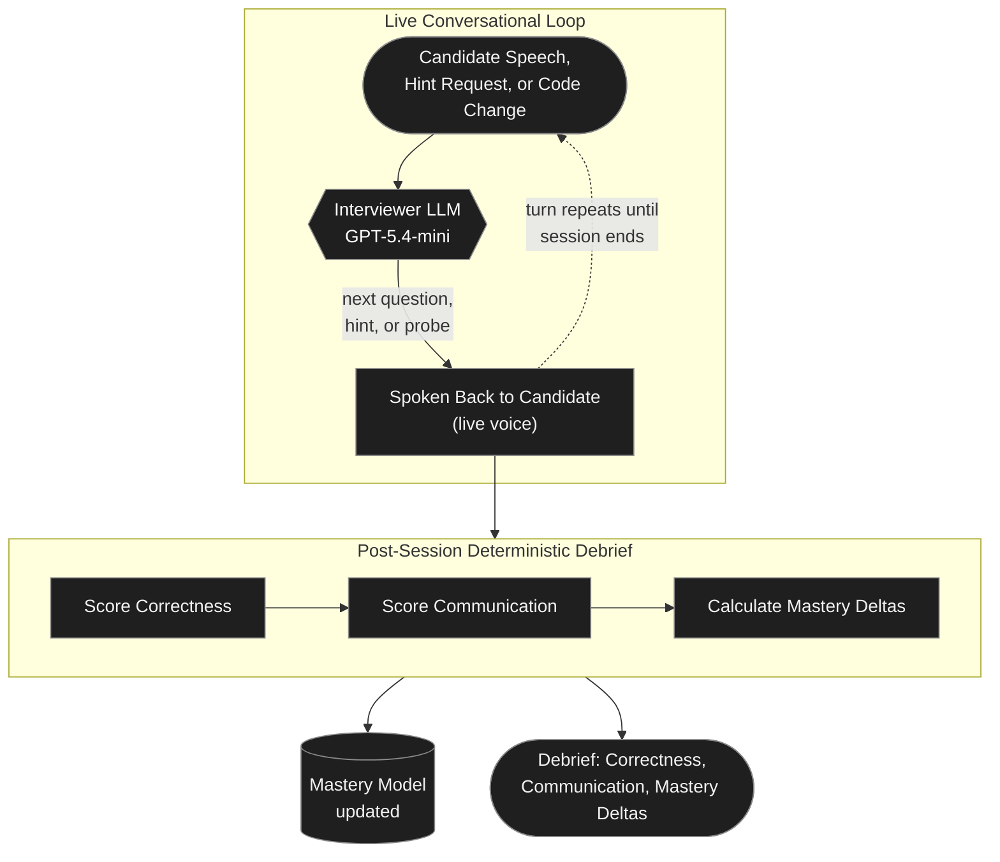

## 4. Interviewer Agent

```mermaid
graph TB
    classDef component fill:#1f1f1f,stroke:#8a8a8a,stroke-width:1px,color:#f2f2f2;
    classDef llm fill:#1f1f1f,stroke:#8a8a8a,stroke-width:1px,color:#ffffff;
    classDef datastore fill:#1f1f1f,stroke:#8a8a8a,stroke-width:1px,color:#f2f2f2;
    classDef deterministic fill:#1f1f1f,stroke:#8a8a8a,stroke-width:1px,color:#f2f2f2;
    classDef io fill:#1f1f1f,stroke:#8a8a8a,stroke-width:1px,color:#f2f2f2;

    subgraph LOOP["Live Conversational Loop"]
        IN(["Candidate Speech,<br/>Hint Request, or Code Change"]):::io --> LLM{{"Interviewer LLM<br/> GPT-5.4-mini"}}:::llm
        LLM -->|"next question,<br/>hint, or probe"| SPEAK["Spoken Back to Candidate<br/>(live voice)"]:::component
        SPEAK -.->|"turn repeats until<br/>session ends"| IN
    end

    SPEAK --> DEBRIEF

    subgraph DEBRIEF["Post-Session Deterministic Debrief"]
        D1["Score Correctness"]:::deterministic
        D2["Score Communication"]:::deterministic
        D3["Calculate Mastery Deltas"]:::deterministic
        D1 --> D2 --> D3
    end

    DEBRIEF --> MM[("Mastery Model<br/>updated")]:::datastore
    DEBRIEF --> OUT(["Debrief: Correctness,<br/>Communication, Mastery Deltas"]):::io
```