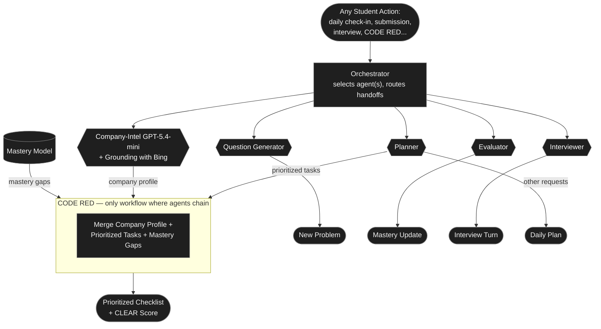

## 6. Multi-Agent Orchestration + CODE RED

```mermaid
graph TB
    classDef component fill:#1f1f1f,stroke:#8a8a8a,stroke-width:1px,color:#f2f2f2;
    classDef llm fill:#1f1f1f,stroke:#8a8a8a,stroke-width:1px,color:#ffffff;
    classDef datastore fill:#1f1f1f,stroke:#8a8a8a,stroke-width:1px,color:#f2f2f2;
    classDef io fill:#1f1f1f,stroke:#8a8a8a,stroke-width:1px,color:#f2f2f2;

    IN(["Any Student Action:<br/>daily check-in, submission,<br/>interview, CODE RED..."]):::io --> ORCH["Orchestrator<br/>selects agent(s), routes handoffs"]:::component

    ORCH --> P{{"Planner"}}:::llm
    ORCH --> Q{{"Question Generator"}}:::llm
    ORCH --> E{{"Evaluator"}}:::llm
    ORCH --> IV{{"Interviewer"}}:::llm
    ORCH --> C{{"Company-Intel GPT-5.4-mini
+ Grounding with Bing"}}:::llm

    Q --> OQ(["New Problem"]):::io
    E --> OE(["Mastery Update"]):::io
    IV --> OI(["Interview Turn"]):::io
    P -->|"other requests"| OP(["Daily Plan"]):::io

    MM[("Mastery Model")]:::datastore -->|"mastery gaps"| CR
    C -->|"company profile"| CR
    P -->|"prioritized tasks"| CR

    subgraph CR["CODE RED — only workflow where agents chain"]
        MERGE["Merge Company Profile +<br/>Prioritized Tasks + Mastery Gaps"]:::component
    end

    CR --> OC(["Prioritized Checklist<br/>+ CLEAR Score"]):::io
```