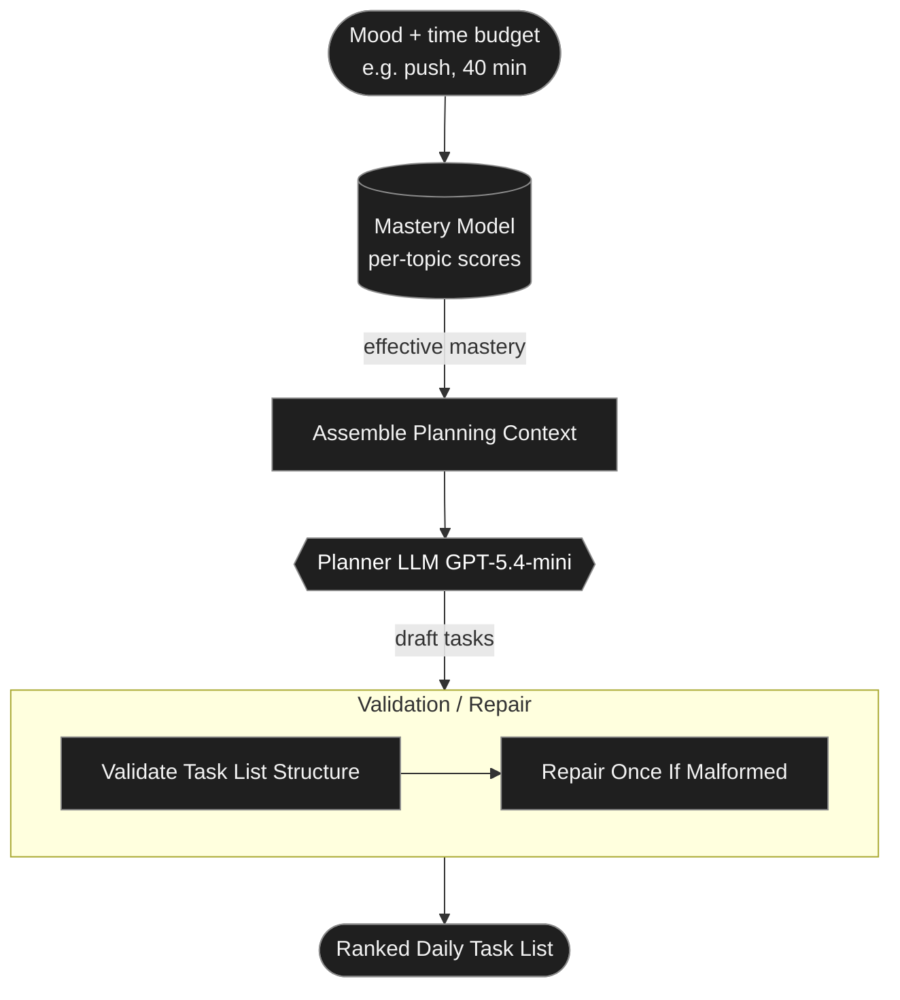

## 1. Planner Agent

```mermaid
graph TB
    classDef component fill:#1f1f1f,stroke:#8a8a8a,stroke-width:1px,color:#f2f2f2;
    classDef llm fill:#1f1f1f,stroke:#8a8a8a,stroke-width:1px,color:#ffffff;
    classDef datastore fill:#1f1f1f,stroke:#8a8a8a,stroke-width:1px,color:#f2f2f2;
    classDef io fill:#1f1f1f,stroke:#8a8a8a,stroke-width:1px,color:#f2f2f2;

    IN(["Mood + time budget<br/>e.g. push, 40 min"]):::io --> MM[("Mastery Model<br/>per-topic scores")]:::datastore
    MM -->|"effective mastery"| CTX["Assemble Planning Context"]:::component
    CTX --> LLM{{"Planner LLM GPT-5.4-mini"}}:::llm
    LLM -->|"draft tasks"| VALID

    subgraph VALID["Validation / Repair"]
        V1["Validate Task List Structure"]:::component
        V2["Repair Once If Malformed"]:::component
        V1 --> V2
    end

    VALID --> OUT(["Ranked Daily Task List"]):::io
```