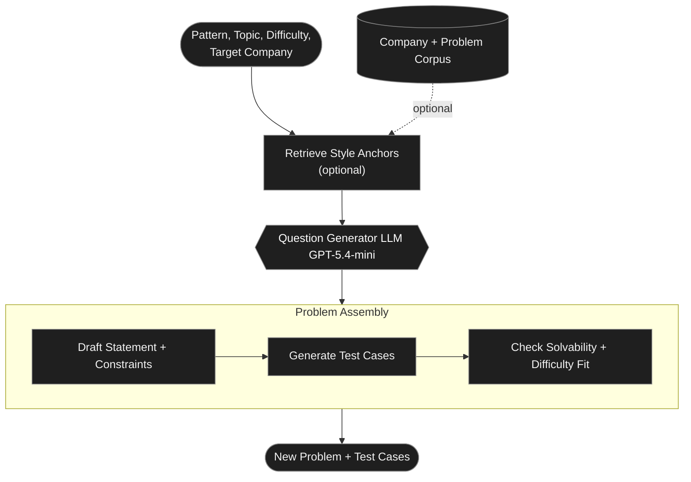

## 2. Question Generator Agent

```mermaid
graph TB
    classDef component fill:#1f1f1f,stroke:#8a8a8a,stroke-width:1px,color:#f2f2f2;
    classDef llm fill:#1f1f1f,stroke:#8a8a8a,stroke-width:1px,color:#ffffff;
    classDef datastore fill:#1f1f1f,stroke:#8a8a8a,stroke-width:1px,color:#f2f2f2;
    classDef io fill:#1f1f1f,stroke:#8a8a8a,stroke-width:1px,color:#f2f2f2;

    IN(["Pattern, Topic, Difficulty,<br/>Target Company"]):::io --> RET["Retrieve Style Anchors<br/>(optional)"]:::component
    CORPUS[("Company + Problem Corpus")]:::datastore -.->|"optional"| RET
    RET --> LLM{{"Question Generator LLM GPT-5.4-mini"}}:::llm
    LLM --> ASSEMBLE

    subgraph ASSEMBLE["Problem Assembly"]
        S1["Draft Statement + Constraints"]:::component
        S2["Generate Test Cases"]:::component
        S3["Check Solvability + Difficulty Fit"]:::component
        S1 --> S2 --> S3
    end

    ASSEMBLE --> OUT(["New Problem + Test Cases"]):::io
```